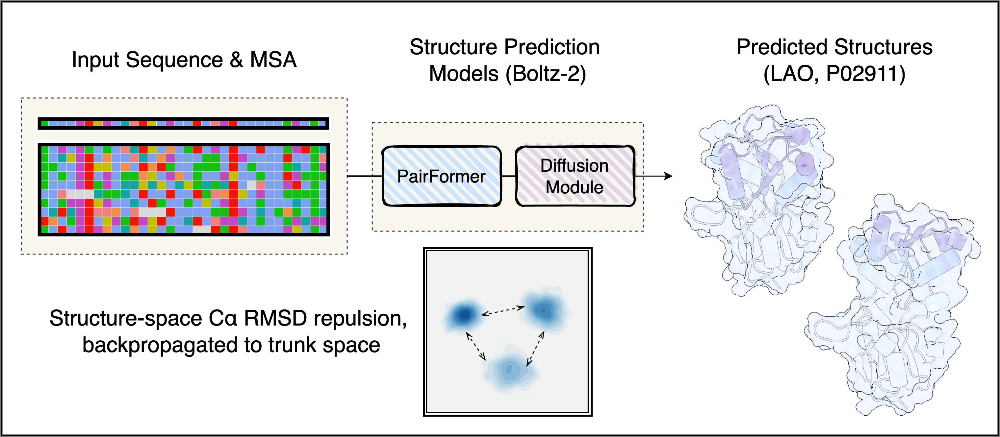

# ConforFlux



ConforFlux is an inference-time procedure for Boltz-2. `M` parallel particles are coupled through a pairwise Cα-RMSD repulsion gradient, back-propagated to the trunk's single and pair embeddings. Each updated trunk is then decoded by Boltz-2's structure module as usual, so one input yields a diverse set of conformations instead of a single dominant prediction.

## Installation

```bash
git clone https://github.com/suzuki-2001/conforflux
cd conforflux
pip install -e ./boltz
pip install -e .
```

The bundled `boltz/` is a copy of Boltz-2 v2.2.1 with one addition, a `guidance_hooks` attribute on the model that the diffusion module consults during inference. Everything else upstream is unchanged.

## Command line

`conforflux predict` forwards every flag to `boltz predict`, and adds a few options of its own.

```bash
conforflux predict input.yaml \
    --out_dir ./out \
    --num_particles 5 \
    --sigma 2.0 \
    --recycling_steps 3 --sampling_steps 200 \
    --output_format pdb
```

| Flag | Default | Meaning |
|---|---|---|
| `--num_particles` | `5` | Coupled particles `M`. Replaces Boltz's `--diffusion_samples`. |
| `--sigma` | `2.0` | RBF kernel bandwidth on Cα RMSD (Å). |
| `--alpha_s` | `0.02` | RMS-normalised step size for the `s_trunk` update. |
| `--alpha_z` | `0.02` | RMS-normalised step size for the `z_trunk` update. |
| `--start_frac` | `0.0` | Diffusion-trajectory fraction at which guidance starts. |
| `--stop_frac` | `0.8` | Diffusion-trajectory fraction at which guidance stops. |
| `--update_interval` | `3` | Fire the gradient every K diffusion steps. |
| `--gradient_checkpointing` | off | Enable gradient checkpointing on the per-particle structure-module forward pass to reduce peak GPU memory. Off by default. |

For broader conformational exploration, raise `--sigma` (e.g. 2.5–4 Å); for tighter clustering around the dominant fold, lower it.

## Container

See [`container/README.md`](container/README.md) for Docker and Apptainer/Singularity usage.
