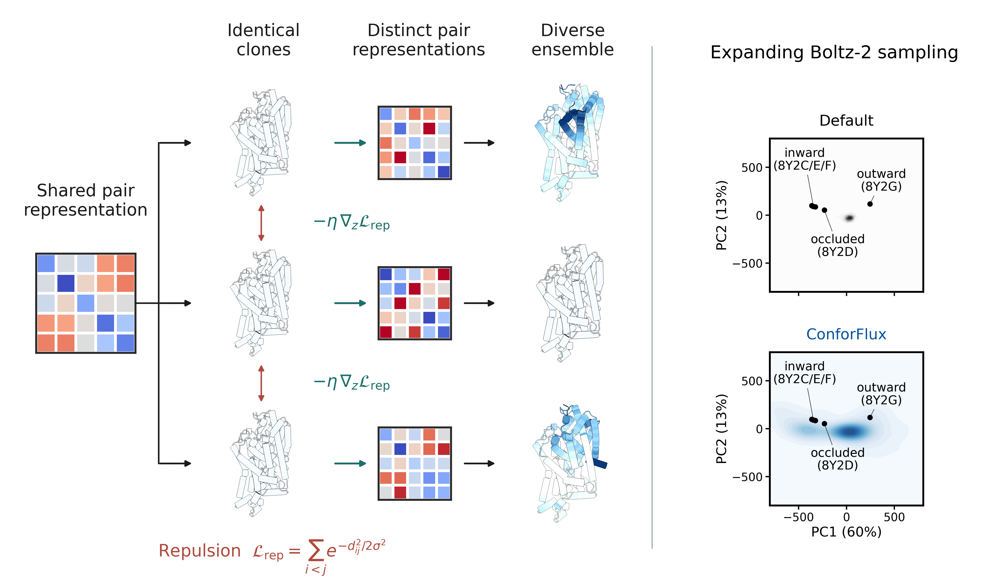

## ConforFlux

ConforFlux is an inference-time procedure for AlphaFold3-class structure predictors, introduced in [Particle-Guided Trunk Repulsion for Diverse Protein Conformations](https://www.biorxiv.org/content/10.64898/2026.05.16.725138v1). `M` parallel particles are coupled through a pairwise Cα-RMSD repulsion gradient, back-propagated to the trunk's single and pair embeddings. Each updated trunk is then decoded by the structure module as usual, so one input yields a diverse set of conformations instead of a single dominant prediction.



Boltz-2, Protenix and OpenFold3-preview2 are bundled, each with ConforFlux added to its own inference command.

## Installation

One environment per backbone.

```bash
git clone https://github.com/suzuki-2001/conforflux
cd conforflux

mamba env create -f envs/boltz.yml       # or conda
mamba env create -f envs/protenix.yml
mamba env create -f envs/openfold3.yml
```

Or into an existing environment:

```bash
pip install -e .                 # the ConforFlux package, shared by all three
pip install -e ./boltz           # Boltz-2
pip install -e ./protenix        # Protenix
pip install -e ./openfold3       # OpenFold3-preview2
```

## Usage

```bash
boltz predict input.yaml --out_dir ./out \
    --num_particles 5 --sigma 2.0 --alpha_s 0.02 --alpha_z 0.02 \
    --recycling_steps 3 --sampling_steps 200 --output_format pdb

protenix pred -i input.json -o ./out \
    --num_particles 5 --sigma 2.0 --alpha_s 0.02 --alpha_z 0.02

run_openfold predict --query_json input.json --output_dir ./out \
    --runner_yaml openfold3/of3_runner.yaml --seeds 101 \
    --num_particles 5 --sigma 2.0 --alpha_s 0.02 --alpha_z 0.02
```

## Options

| Flag | Default | Meaning |
|---|---|---|
| `--num_particles` | `5` | Coupled particles `M`. Replaces the backbone's own sample-count flag. `0` runs the backbone unguided. |
| `--sigma` | `2.0` | RBF kernel bandwidth on Cα RMSD (Å). |
| `--alpha_s` / `--alpha_z` | `0.02` | RMS-normalised step size for the single and pair embedding. |
| `--update_interval` | `5` | Fire the gradient every K diffusion steps. |
| `--gradient_checkpointing` | off | Reduce peak GPU memory. Boltz-2 and OpenFold3. |
| `--seeds` | — | OpenFold3 only; comma-separated list. Upstream draws its seeds from a fixed start seed. |

## Container

One image per backbone:

```bash
apptainer build --build-arg BACKBONE=boltz conforflux.sif container/Singularity.def
docker build --build-arg BACKBONE=protenix -f container/Dockerfile -t conforflux .
```

`BACKBONE` is `boltz` (default), `protenix` or `openfold3`. See [`container/README.md`](container/README.md) for the run invocations.

## Citation

```bibtex
@article{suzuki2026conforflux,
  title   = {ConforFlux: Particle-Guided Trunk Repulsion for Diverse Protein Conformations},
  author  = {Suzuki, Shosuke and Amagasa, Toshiyuki},
  journal = {bioRxiv},
  year    = {2026},
  doi     = {10.64898/2026.05.16.725138},
  url     = {https://www.biorxiv.org/content/10.64898/2026.05.16.725138v1},
  publisher = {Cold Spring Harbor Laboratory}
}
```
