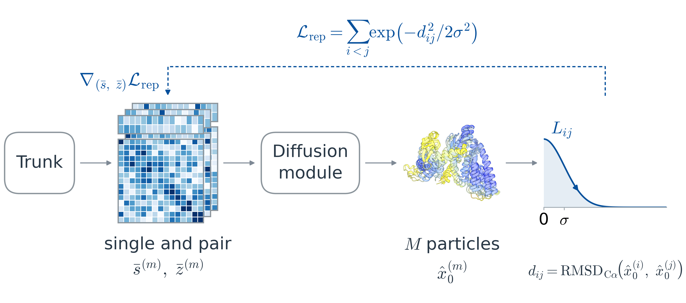

## ConforFlux

ConforFlux is an inference-time procedure for AlphaFold3-class structure predictors, introduced in *ConforFlux: Particle-Guided Trunk Repulsion for Diverse Protein Conformations* (NeurIPS 2026; [preprint](https://www.biorxiv.org/content/10.64898/2026.05.16.725138v1)). `M` parallel particles are coupled through a pairwise Cα-RMSD repulsion gradient, back-propagated to the trunk's single and pair embeddings. Each updated trunk is then decoded by the structure module as usual, so one input yields a diverse set of conformations instead of a single dominant prediction.



Boltz-2, Protenix and OpenFold3-preview2 are bundled, each with ConforFlux added to its own inference command.

## Installation

One environment per backbone.

```bash
git clone https://github.com/suzuki-2001/conforflux
cd conforflux

mamba env create -f envs/boltz.yml       # or conda
mamba env create -f envs/protenix.yml
mamba env create -f envs/openfold3.yml
```

Or into an existing environment:

```bash
pip install -e .                 # the ConforFlux package, shared by all three
pip install -e "./boltz[cuda]"   # Boltz-2, with the cuEquivariance kernels
pip install -e ./protenix        # Protenix
pip install -e ./openfold3       # OpenFold3-preview2
```

## Usage

```bash
boltz predict input.yaml --out_dir ./out \
    --num_particles 5 --sigma 2.0 --alpha_s 0.02 --alpha_z 0.02 \
    --recycling_steps 3 --sampling_steps 200 --output_format pdb

protenix pred -i input.json -o ./out \
    --num_particles 5 --sigma 2.0 --alpha_s 0.02 --alpha_z 0.02

run_openfold predict --query_json input.json --output_dir ./out \
    --runner_yaml openfold3/of3_runner.yaml --seeds 101 \
    --num_particles 5 --sigma 2.0 --alpha_s 0.02 --alpha_z 0.02
```

## Options

| Flag | Default | Meaning |
|---|---|---|
| `--num_particles` | `5` | Coupled particles `M`. Replaces the backbone's own sample-count flag. `0` runs the backbone unguided. |
| `--sigma` | `2.0` | RBF kernel bandwidth on Cα RMSD (Å). One value per run. The paper sweeps 0.5–2.5. |
| `--alpha_s` / `--alpha_z` | `0.02` | RMS-normalised step size for the single and pair embedding. |
| `--update_interval` | `3` | Fire the gradient every K diffusion steps. |
| `--noise_level` | off | Scale the step by the noise level of the step it is applied at. Pushes harder: a wider ensemble at a higher clashscore. |
| `--reg_weight` | `0`, or `0.1` with `--target_samples` | Pull the embeddings back toward the trunk's own: each update removes this fraction of their displacement from it. |
| `--target_samples` | `0` | Run the sampling pipeline below until this many samples pass the filter. `0` runs once. |
| `--sigmas` | `0.5,…,2.5` | Bandwidths the pipeline's rounds cycle through. |
| `--plddt_filter` | off | Add the pLDDT criterion to the pipeline's filter. |
| `--num_reference` | `5` | Unguided predictions made for `--plddt_filter`. |
| `--max_rounds` | `20` | Guided rounds before the pipeline stops, filled or not. |
| `--gradient_checkpointing` | off | Reduce peak GPU memory. Boltz-2 and OpenFold3. |
| `--seeds` | — | OpenFold3 only, comma-separated. Upstream draws its seeds from a fixed start seed. |

Without `--target_samples` the defaults are the paper's `Ours (λ)`, and `--noise_level` gives `Ours (λ_t)`. `--reg_weight` and the pipeline are not used in the paper.

## Sampling pipeline

```bash
boltz predict input.yaml --out_dir ./out --num_particles 5 --target_samples 50
```

1. Guided rounds of `--num_particles`, one seed each, cycling through `--sigmas`, with `--reg_weight 0.1`.
2. Every sample goes through the geometry filter below, and with `--plddt_filter` also through the pLDDT filter against `--num_reference` unguided predictions made first.
3. Rounds stop once `--target_samples` have passed or after `--max_rounds`; if more passed than asked for, the highest mean pLDDT are kept.

Each input gets its own directory, named after it, holding `rounds/`, the selected structures in `kept/` and as one multi-model mmCIF in `kept.cif`, every sample's filter result in `samples.tsv`, the settings in `run.json`, and with `--plddt_filter` the unguided predictions in `unguided/`. The same flags work with `protenix pred` and `run_openfold predict`.

## Filter

Geometry, from ConforMix's sample filter: consecutive Cα–Cα under 4.5 Å, C–N under 2.0 Å, and no heavy atoms within 0.5 Å between residues of one chain three or more apart. pLDDT, ConforMix's windowed criterion: no 10-residue window whose mean pLDDT falls more than 0.2 below the per-residue minimum of the unguided predictions. pLDDT is read from the B-factor column; Protenix writes it there only with `--need_atom_confidence true`, which the pipeline sets. To filter existing predictions:

```bash
python -m conforflux.filter ./guided --reference ./unguided --out filter.tsv --keep_dir ./kept
```

Without `--reference` only the geometry is checked.

## Container

One image per backbone:

```bash
apptainer build --build-arg BACKBONE=boltz conforflux.sif container/Singularity.def
docker build --build-arg BACKBONE=protenix -f container/Dockerfile -t conforflux .
```

`BACKBONE` is `boltz` (default), `protenix` or `openfold3`. See [`container/README.md`](container/README.md) for the run invocations.

## Citation

```bibtex
@inproceedings{suzuki2026conforflux,
  title     = {ConforFlux: Particle-Guided Trunk Repulsion for Diverse Protein Conformations},
  author    = {Suzuki, Shosuke and Amagasa, Toshiyuki},
  booktitle = {Advances in Neural Information Processing Systems},
  year      = {2026}
}
```
